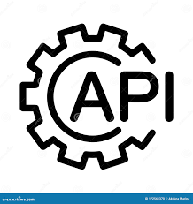

<<<<<<< HEAD

  
  

    

  

  
  <h1>
    Hello 
    
  </h1>

### About Me :
I have backgroung in reserch, data analysis and teaching. I have Masters degree in Physics and I am currently enrolled in Data Analytics bootcamp at University of Toronto
- :seedling: I enjoy coding, reading and learning new things.
- 👩‍💻currently learning machine learning

- :zap: In my free time, I love making stuff with crochet

- :e-mail: You can reach me at: rimpledabas@gmail.com

### ⚒️ Languages and Tools :

  &nbsp;
  &nbsp;
  &nbsp;
  &nbsp;
  &nbsp;
  &nbsp;
  &nbsp;
  &nbsp;
  &nbsp;
  
 
---

### :fire: My Stats :

=======
Hello , I am Rimple. I have Masters degree in Physics and Optics. I have background in teaching , data analysis and research. I am currently enrolled in data analytics course at UofT. 
>>>>>>> 3a2b95645007e267fd75bfc7abcc0670bf83c098
